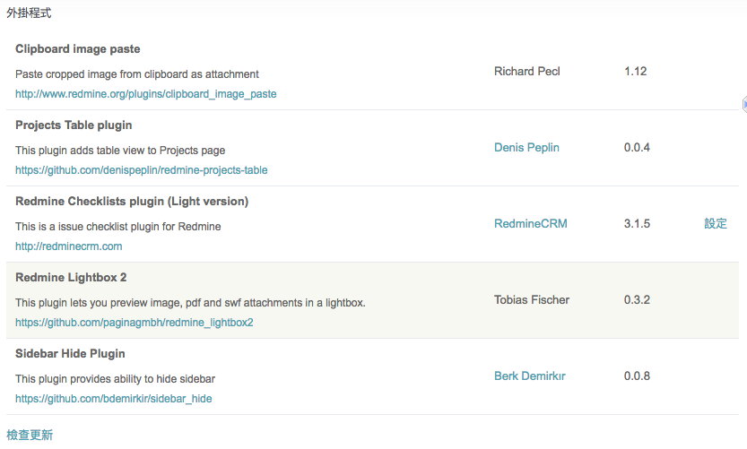

# how to use

1. docker-compose up -d
2. 等待約 3 分鐘，redmine 會被建立起來
3. 第一次登入，會要求 admin 更新密碼
4. 可至設定中，更新 theme

## theme

- abacus theme 1.0.9

## docker container create

1. mysql
2. redmine
    - localhost:3000
    - admin/admin
3. phpmyadmin
    - localhost:8080
    - root/root

## redmine 已加入的 plugin
- [Project Table](http://www.redmine.org/plugins/projects_table)  
- [Redmine Lightbox2](https://github.com/paginagmbh/redmine_lightbox2)
- [Attach image from clipboard](http://www.redmine.org/plugins/clipboard_image_paste)
- [redmine_checklists](http://www.redminecrm.com/projects/checklist/pages/1)
- [sidebar_hide](https://github.com/bdemirkir/sidebar_hide)

