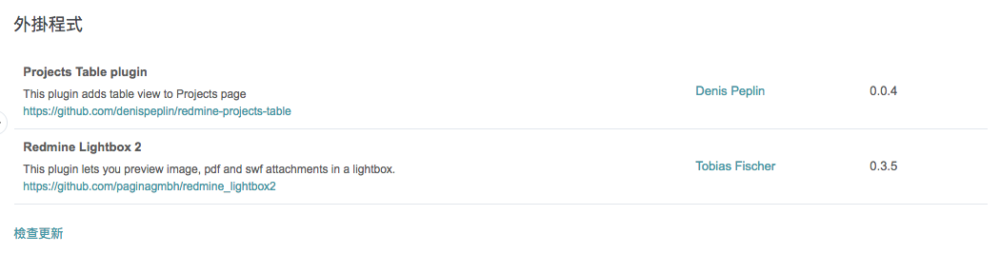

# how to use
    
1. docker-compose up -d 
	- **若要開啟 email(google) 寄送功能，填寫 configuration.yml，設定好帳號密碼**
2. 開啟瀏覽器, `localhost:8000`, 預設帳密 admin/admin
3. 可至設定中，更新 theme
4. 可至設定中，測試 mail 寄送
	- 若要更改設定，請更改後執行 `docker-compose restart`

# docker container
1. mysql
    - 預設為 utf-8
2. redmine
    - localhost:8000
    - admin/admin
3. phpmyadmin
    - localhost:8001
    - root/root

# plugins

> 預設的 container 並無安裝任何 plguins

## plugins script 預設提供以下常用工具

- [Project Table](http://www.redmine.org/plugins/projects_table)  
- [Redmine Lightbox2](https://github.com/paginagmbh/redmine_lightbox2)

## 如何安裝
1. `docker exec -it redmine /bin/bash`
2. `sh /usr/src/plugins/plugins.sh` : 執行過就不用在執行
3. `exit && docker-compose restart`

## 其他可參考 ... 
> 可到官網參考更多

- [Attach image from clipboard](http://www.redmine.org/plugins/clipboard_image_paste)
- [redmine_checklists](http://www.redminecrm.com/projects/checklist/pages/1)
- [sidebar_hide](https://github.com/bdemirkir/sidebar_hide)